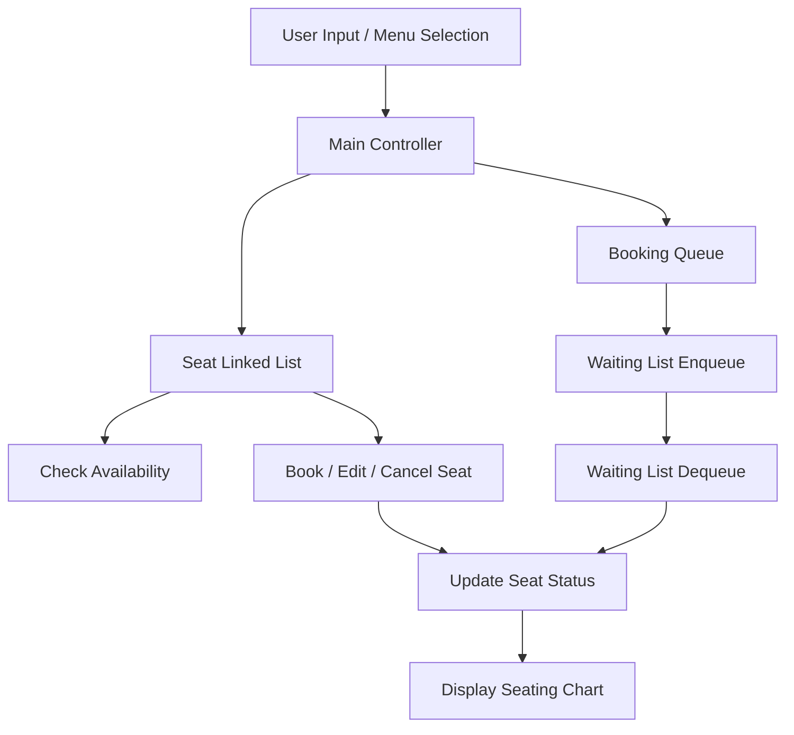

# 🎟️ Waiting List Management System (C)

A console-based **Waiting List Management System** implemented in **C**, demonstrating the practical use of **linked lists** and **queues** to manage seat bookings efficiently. The system supports booking, cancellation, editing, and automatic handling of waiting-list requests.

---

## ✨ Features

* Seat availability checking
* Seat booking with passenger details
* Automatic waiting list using a queue
* Booking cancellation and editing
* Real-time seating chart display
* Menu-driven console interface

---

## 🧠 Core Concepts Used

* Singly Linked List (Seat Management)
* Queue (Waiting List Handling)
* Dynamic Memory Allocation
* Modular Programming in C

---

## 🛠️ Tech Stack

* **Language:** C
* **Headers Used:**

  * stdio.h
  * stdlib.h
  * string.h
  * stdbool.h

---

## 📂 Project Structure

```
waiting-list-system/
│
├── waiting_list.c   # Main source code
└── README.md        # Project documentation
```

---

## ⚙️ How It Works

* Seats are stored in a **linked list**, each node representing a seat.
* If a seat is already booked, the request is added to a **queue (waiting list)**.
* When a booking is canceled, queued requests are processed automatically.
* Passenger details are stored and updated directly in seat nodes.

---

## 🏗️ System Architecture



### Architecture Description

The system follows a modular architecture using two core data structures. A linked list manages seat details and booking status, while a queue handles waiting-list requests. User actions flow through the main controller, ensuring efficient seat allocation and automatic waiting-list processing.

---

## 🚀 How to Run

### 1️⃣ Compile the Program

```bash
gcc waiting_list.c -o waiting_list
```

### 2️⃣ Execute

```bash
./waiting_list
```

---

## 📊 Menu Options

1. Check seat availability
2. Book a seat
3. Cancel booking
4. Edit booking
5. Display seating chart
6. Exit

---

## 🧪 Example Use Cases

* Railway reservation simulation
* Bus or theater seat management
* Data Structures laboratory exercises
* Interview and exam demonstrations

---

## ⚠️ Limitations

* Fixed number of seats
* Console-based interface only
* No persistent storage (data resets on exit)

---

## 🔮 Future Enhancements

* File-based data persistence
* Priority-based waiting list
* Graphical user interface
* Dynamic seat configuration

---

## 📜 License

This project is licensed under the **MIT License**.

---

## 🌟 Author

Developed as an academic project to demonstrate **Linked Lists and Queues** in C.

A ⭐ on GitHub helps others discover this project.
